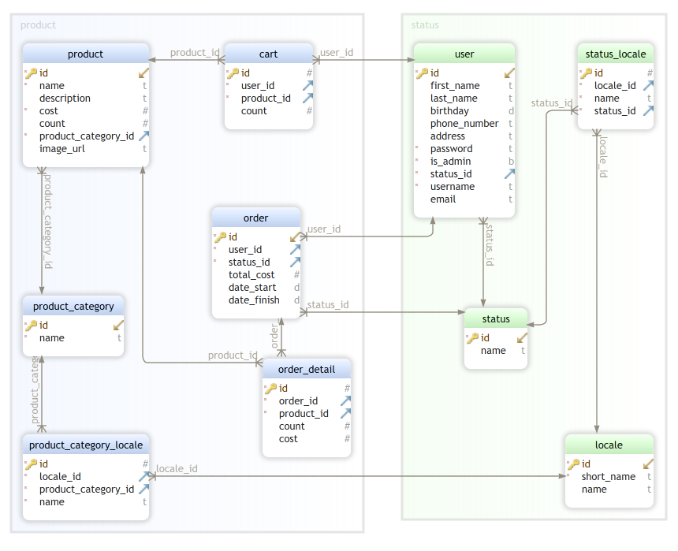

# InternetMarket

#### Учетные записи:
|         | Пользователь  | Админ         |
|---------|:-------------:|:-------------:| 
|username:|`user`         |`admin`        |
|password:|`user1111`     |`admin1111`    |
#### Для развертки понадобятся:
*Apache Tomcat 8.5.77 + PostgreSQL 10.20 + JDK-11*
#### Порядок развертки:
1. Клонируем репозиторий с гитхаба в IDE по ссылке (для IDEA):
    >File -> New -> Project from VersionControl -> URL: https://github.com/arttschie/InternetMarket.git 
2. Создайте свою базу данных и выполните sql скрипт:
    >CREATE DATABASE internet_market

    >путь к скрипту: *files/internet_market.sql*
3. Добавьте поддержку Web Framework, и укажите путь до папки 'web' в корне приложения:
    >File -> Project Structure -> Facets -> Add ('+') -> Web -> Deployment descriptors path: ...\InternetMarket\web\WEB-INF\web.xml 
    
    >Web resource directory: ...\InternetMarket\web

4. Скачайте Apache Tomcat и подключите к проекту:
    >Apache Tomcat 8.5.77: https://archive.apache.org/dist/tomcat/tomcat-8/v8.5.77/bin/apache-tomcat-8.5.77.zip

    >Run -> Edit Configurations... -> Add New Configuration ("+") -> Tomcat server -> local
5. Указываем путь к папке с Tomcat, указываем JDK и добавляем артефакт: 
    >Deployment -> Add ('+') -> Artifact
             
    >Очищаем поле Application context
6. Меняем файл *database.resources* под свои данные
    >путь к файлу: src\main\resources\database.resources
7. Запускаем приложение
